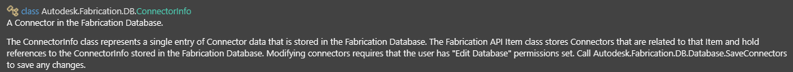
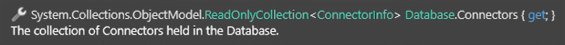

<h1 align="center">
  Autodesk FabricationAPI XML Docs
</h1>

## Introduction
We recently started working with Autodesk's FabricationAPI for one of our tools. For some reason, Autodesk didn't supply an XML documentation file with their code as they did with the Revit API and instead supplied a [.CHM help file](https://en.wikipedia.org/wiki/Microsoft_Compiled_HTML_Help) (<i>a help file format introduced in Windows 95</i>). 

We needed an XML file of the documentation to see what we were doing while using the API within Visual Studio, so we worked to do something <b>Autodesk couldn't do</b> and built one manually.

## Process
The .chm help file contained all of the information we needed. So by using Microsoft's `hh` program, we were able to extract all of the .html files from the .chm file.

Using [SandCastle Help File Builder](https://github.com/EWSoftware/SHFB), we were able to create a 'skeleton' XML file that contains all of the members present in the Fabrication API DLL file.

We then created a simple C# program to cross-reference the members in the XML file with the .html files generated from the `hh` program, filling all of the member information found from the .html files.

## Closing
As of right now, the XML files contain all of the necessary member information including types, parameters and methods. Much of the documentation is very straight forward (literally what Autodesk wrote in their help file), but there is definitely some useful information that can be found from these XML documentation files. 

If you plan on working with the Fabrication API and want Visual Studio IntelliSense for it, these are for you.

## Images

